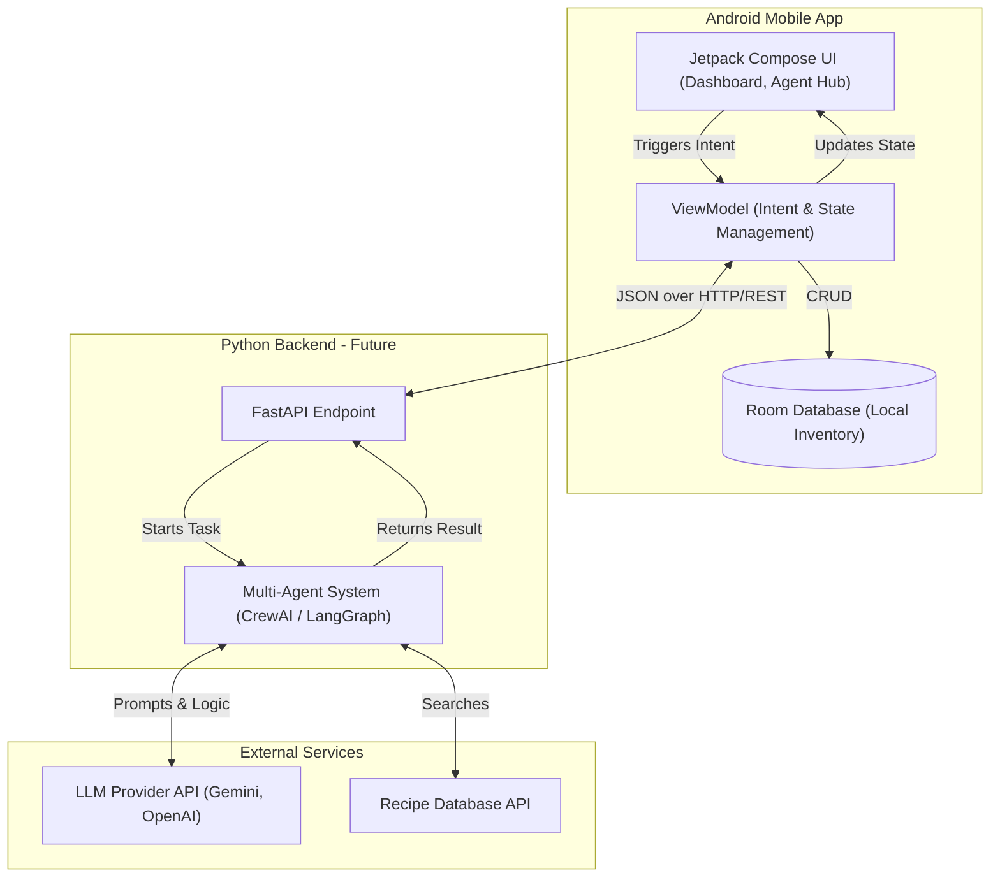

# KitchenMind - AI Agent Planning Document

## 1. Project Overview

**Website/App Topic and Purpose**
KitchenMind is a smart kitchen inventory management mobile application. Its primary purpose is to help users track their food items, minimize food waste by highlighting expiring products, and eventually provide intelligent meal planning suggestions based on the current inventory.

**Target Users**
*   Individuals and families who buy groceries regularly and want to reduce food waste.
*   People looking for inspiration on what to cook with the ingredients they already have.
*   Environmentally conscious users aiming to optimize their food consumption.

**Core Features of the Mobile App (Draft Version)**
*   **Dashboard:** A dynamic list of current kitchen inventory, displaying item names, quantities, and highlighted expiry dates (expiring soon or already expired).
*   **Add Item:** A clean, intuitive form to input new food items with a date picker for accurate expiry tracking.
*   **Agent Hub:** A dedicated interface designed to host the future AI Agent interactions, currently serving as a placeholder for intelligent scanning and optimization messages.

---

## 2. AI Agent Concept

**What problem will the AI agent solve?**
The biggest challenge in kitchen management is the "What do I cook with this before it goes bad?" dilemma. The AI agent will solve the problem of cognitive overload in meal planning and actively work to reduce food waste by analyzing the user's inventory and suggesting optimal recipes.

**What type of agent will it be?**
The agent will function primarily as an **Advisor and Recommender**.
Specifically, it will be a multi-agent system (e.g., built with CrewAI or LangGraph) consisting of:
1.  *Inventory Analyst Agent:* Analyzes the database for expiring items.
2.  *Culinary Chef Agent:* Searches for or generates recipes based strictly on the available and expiring ingredients.
3.  *Health & Nutrition Agent (Optional future addition):* Ensures the suggested recipes meet user dietary preferences.

**How users will interact with the agent?**
Users will interact with the agent primarily through two methods:
1.  **Background Automation:** The agent will periodically scan the local database (synchronized to the backend) and proactively send a notification or a new `Intent` to the app if a critical item is about to expire, along with a quick recipe idea.
2.  **Chat / Agent Hub:** Users can open the "Agent Hub" screen (created in the draft version) and natural-language ask questions like: "What can I make for dinner tonight?" The agent will read the current `InventoryState` and provide a conversational response.

---

## 3. System Architecture (High-Level)

To seamlessly integrate an advanced AI Agent (like CrewAI, AutoGen, or LangGraph) into an Android application, the architecture requires a robust separation of concerns. The mobile app itself does not run the Heavy Language Models; instead, it delegates to a backend.

**How the AI agent will interact with the system:**

1.  **Frontend (Android / Jetpack Compose):** 
    *   Built using the **MVI (Model-View-Intent)** pattern.
    *   User actions (e.g., clicking "Get Recipe" in the Agent Hub) trigger an `InventoryIntent.GetAISuggestion`.
    *   The `ViewModel` handles this intent and makes an API call to the backend.
    *   When the backend responds with the AI's suggestion, the `ViewModel` updates the `InventoryState.agentMessage`.
    *   The Jetpack Compose UI automatically reacts to this state change and displays the message in the Agent Hub.

2.  **Backend (Python / FastAPI -- Future Implementation):**
    *   A lightweight Python backend will serve as the orchestrator.
    *   It will expose REST or WebSocket endpoints (e.g., `/api/v1/agent/suggest`).
    *   It will host the Multi-Agent framework (CrewAI/LangGraph).
    *   When the Android app sends the current inventory list (JSON) to the backend, the backend passes this data as "context" to the AI Agents.

3.  **External APIs or Services:**
    *   **LLM Provider:** The Python backend will connect to an LLM provider (like OpenAI GPT-4o, Anthropic Claude, or Google Gemini) to power the reasoning engine of the agents.
    *   **External Recipe APIs (Optional):** The *Culinary Chef Agent* might call external APIs (like Spoonacular) to fetch structured recipe data if it decides not to generate a recipe from scratch.

**Simple Architecture Diagram (Text-based)**

